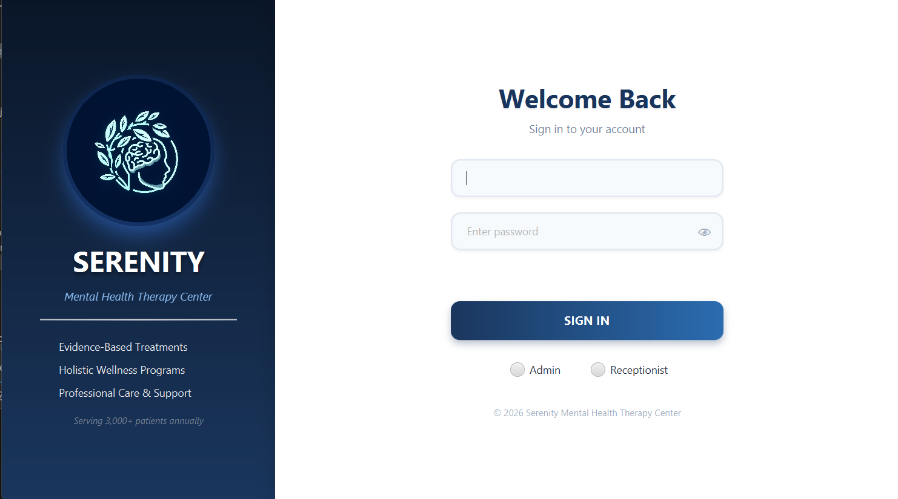

# Mental Health Therapy Center


## Screenshot


=======
A desktop management system for a mental health therapy center, built with **JavaFX** and **Hibernate (JPA)**. It supports patient management, therapist management, therapy program management, session scheduling, payments, and reporting, with role-based access for **Admin** and **Receptionist** users.

## Features

- **Authentication** — secure login with BCrypt-hashed passwords and role selection (Admin / Receptionist)
- **Patient Management** — register and maintain patient records, including therapy progress
- **Therapist Management** — manage therapist profiles, specializations, and availability
- **Therapy Program Management** — define programs, durations, fees, and assigned therapists
- **Session Scheduling** — schedule and track therapy sessions between patients and therapists
- **Payments** — record and track patient payments and payment status
- **Reports** — generate operational reports
- **Role-based Dashboards** — separate dashboards for Admin and Receptionist
- **Change Password** — allow logged-in users to update their credentials


## Project Structure

```
src/main/java/lk/ijse/mental_health_therapy/
├── Config/                 # Hibernate SessionFactory setup & user seeding
├── bo/                     # Business Object interfaces + custom/impl
├── controller/             # JavaFX FXML controllers
├── dao/                    # DAO interfaces + custom/impl
├── dto/                    # Data Transfer Objects
├── entity/                 # JPA entities
└── Launcher.java           # Application entry point

src/main/resources/
├── *.fxml                  # JavaFX views (login, dashboards, management screens)
├── asses/Style/*.css       # Stylesheets per screen
├── hibernate.properties    # Database & Hibernate configuration
└── ehcache.xml             # Second-level cache configuration


